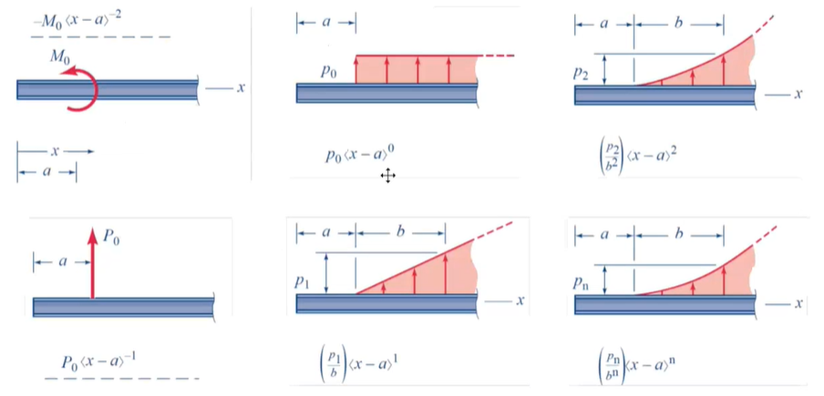
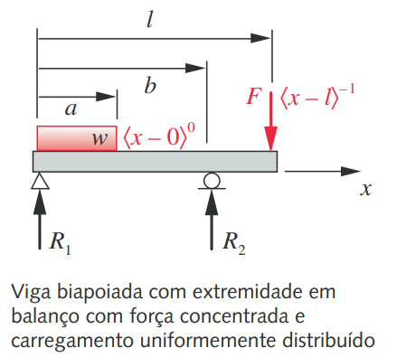
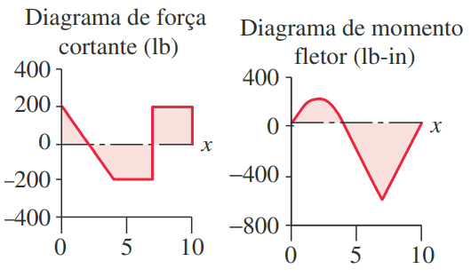
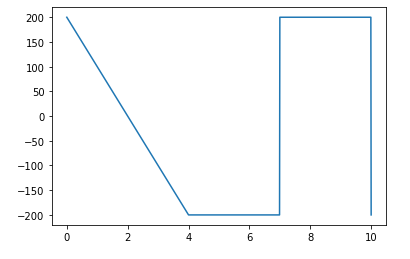
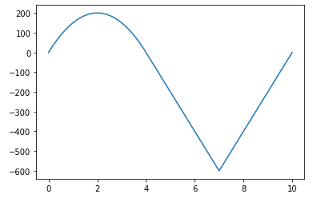

# Resistência dos Materiais

## Objetivos

* No arquivo `EsforcosEmVigas.py`
  1. :wrench: Aplicando conceitos de resistência dos materiais para o calculo de esforços em vigas.
  2. :wrench: O script também é capaz de plotar os diagramas de esforço cortante e momento fletor usando as funções de Macaulay.
  

* No arquivo `CirculoDeMohr.py`
  1. :wrench: Visualizar as componentes de tensão, cisalhante e normal, aplicadas em um corpo sujeito
  a um estado plano de tensões.  
  [Representação Do Estado Plano de Tensões](https://www.google.com/url?sa=i&url=https%3A%2F%2Fwww.tecconcursos.com.br%2Fquestoes%2F125416&psig=AOvVaw12HxkeAaYyapSrIunU0Tus&ust=1646628409819000&source=images&cd=vfe&ved=0CAsQjRxqFwoTCLi3p_7WsPYCFQAAAAAdAAAAABAJ)

  2. :wrench: Tabém é capaz de plotar o gráfico do Cículo de Mohr para visuzalização dos pontos exatos das forças.

## Módulos Python utilizados
Para instalação dos módulos utilize os comandos abaixo direto no terminal.

  * Numpy
    > `pip install numpy`

  * Matplotlib
    > `pip install matplotlib`

  * Math

## Exemplos Testados

* Para validar a confiabilidade do script `EsforcosEmVigas.py`, foi pego um exercício resolvido do livro cujo autor é [Robert L. Norton](https://www.google.com/url?sa=i&url=https%3A%2F%2Fwww.amazon.com.br%2FProjeto-M%25C3%25A1quinas-Uma-Abordagem-Integrada%2Fdp%2F8582600224&psig=AOvVaw1OhqyuGKCk3UHfkoF2sHj5&ust=1646631443343000&source=images&cd=vfe&ved=0CAsQjRxqFwoTCOiJ1qTisPYCFQAAAAAdAAAAABAD).

* O modelo do exercício escolhido foi:  

* E os resultados do livro são:  

* O que valida com os diagramas plotados pelo script `EsforcosEmVigas.py`  
 

## Conclusão
Portanto, a confiabilidade do script `EsforcosEmVigas.py` é satisfatória para tais aplicação. Com isso, basta fazer o clone do repositório e mudar as váriáveis de esforços e compilar o código.
